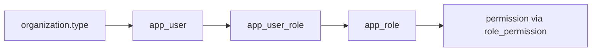

# Авторизация и RBAC

Модель доступа Sauda: **multi-tenant по `organization`** + **RBAC** (роли и permissions в БД).

Источник правды: миграция `backend/sauda-api/src/main/resources/db/migration/V2__init.sql`  
JPA: `com.sauda.domain.entity.{Role, Permission, AppUser}`  
Коды ролей в Java: `com.sauda.domain.enums.RoleCode`

> Spring Security пока **не подключён** — см. [architecture.md](architecture.md).  
> Схема и seed-данные готовы, чтобы при включении Security проверять `permission.code` через `@PreAuthorize`.

---

## Два измерения доступа



| Измерение | Где | Что определяет |
|-----------|-----|----------------|
| **Tenant** | `organization.type` + FK на `organization_id` | Какие **данные** видит пользователь (своя org) |
| **RBAC** | `app_user_role` → `app_role` → `permission` | Какие **действия** может выполнять |

Триггер `trg_app_user_role_org_type` в БД запрещает выдать роль, если её `organization_type` не совпадает с типом организации пользователя.

---

## Таблицы RBAC

| Таблица | Назначение |
|---------|------------|
| `app_role` | Роль с кодом (`code`), привязкой к `organization_type`, именем |
| `permission` | Право в формате `resource:action` |
| `role_permission` | M:N — какие permissions у роли |
| `app_user_role` | M:N — какие роли у пользователя (можно несколько) |

Пользователь **не имеет** колонки `role` — только связи через `app_user_role`.

---

## Типы организаций

| `organization.type` | Участник | Типичные роли |
|---------------------|----------|---------------|
| `platform` | Оператор Sauda | `platform_admin` |
| `distributor` | Поставщик / дистрибьютор | `distributor_manager`, `distributor_viewer` |
| `buyer` | Покупатель (магазин) | `buyer`, `buyer_approver` |

---

## Роли (seed)

| Код | Org type | Описание |
|-----|----------|----------|
| `platform_admin` | `platform` | Каталог, лоты, матчинг, управление платформой |
| `buyer` | `buyer` | Просмотр офферов, корзина, создание заказов |
| `buyer_approver` | `buyer` | Всё у `buyer` + утверждение заказов (`order:approve`) |
| `distributor_manager` | `distributor` | Прайсы, импорт, ревью матчей |
| `distributor_viewer` | `distributor` | Только чтение данных дистрибьютора |

Один пользователь может иметь **несколько ролей**, например `buyer` + `buyer_approver`:

```sql
INSERT INTO app_user_role (user_id, role_id)
SELECT u.id, r.id
FROM app_user u
CROSS JOIN app_role r
WHERE u.email = 'manager@shop.kz'
  AND r.code IN ('buyer', 'buyer_approver');
```

---

## Permissions (seed)

Формат кода: **`{resource}:{action}`**.

| Код | Resource | Action | Описание |
|-----|----------|--------|----------|
| `org:read` | organization | read | Просмотр профиля организации |
| `org:manage` | organization | manage | Настройки организации |
| `canonical_product:read` | canonical_product | read | Просмотр каталога |
| `canonical_product:manage` | canonical_product | manage | Создание/редактирование каталога |
| `offer:read` | offer | read | Просмотр офферов / прайса |
| `offer:manage` | offer | manage | Создание/редактирование офферов |
| `import:run` | import | run | Загрузка и запуск импорта прайса |
| `import:read` | import | read | История импортов и ошибки |
| `lot:read` | lot | read | Просмотр лотов |
| `lot:create` | lot | create | Создание лотов |
| `lot:manage` | lot | manage | Обновление и архивация лотов |
| `lot_match:read` | lot_match | read | Просмотр матчей |
| `lot_match:review` | lot_match | review | Ревью и смена статуса матча |
| `lot_match:manage` | lot_match | manage | Полное управление матчами |
| `cart:read` | cart | read | Просмотр корзин |
| `cart:manage` | cart | manage | Создание и изменение корзин |
| `order:read` | order | read | Просмотр заказов |
| `order:create` | order | create | Создание и отправка заказов |
| `order:approve` | order | approve | Утверждение / отклонение заказов |
| `cost_center:read` | cost_center | read | Просмотр центров затрат |
| `cost_center:manage` | cost_center | manage | Управление центрами затрат |
| `spend_limit:read` | spend_limit | read | Просмотр лимитов расходов |
| `spend_limit:manage` | spend_limit | manage | Управление лимитами |

---

## Матрица: роль × permission

✅ — permission выдано роли (из seed `V2__init.sql`).

### Platform

| Permission | platform_admin |
|------------|:--------------:|
| org:read | ✅ |
| org:manage | ✅ |
| canonical_product:read | ✅ |
| canonical_product:manage | ✅ |
| offer:read | ✅ |
| import:read | ✅ |
| lot:read | ✅ |
| lot:create | ✅ |
| lot:manage | ✅ |
| lot_match:read | ✅ |
| lot_match:review | ✅ |
| lot_match:manage | ✅ |

### Buyer

| Permission | buyer | buyer_approver |
|------------|:-----:|:--------------:|
| org:read | ✅ | ✅ |
| offer:read | ✅ | ✅ |
| cart:read | ✅ | ✅ |
| cart:manage | ✅ | ✅ |
| order:read | ✅ | ✅ |
| order:create | ✅ | ✅ |
| order:approve | | ✅ |
| cost_center:read | ✅ | ✅ |
| spend_limit:read | | ✅ |

### Distributor

| Permission | distributor_manager | distributor_viewer |
|------------|:-------------------:|:------------------:|
| org:read | ✅ | ✅ |
| offer:read | ✅ | ✅ |
| offer:manage | ✅ | |
| import:run | ✅ | |
| import:read | ✅ | ✅ |
| lot_match:read | ✅ | ✅ |
| lot_match:review | ✅ | |

---

## Связь с доменными таблицами

| Домен | Кто обычно действует | Ключевые permissions |
|-------|----------------------|----------------------|
| Каталог (`canonical_product`) | `platform_admin` | `canonical_product:*` |
| Прайс (`offer`, `import_run`) | `distributor_manager` | `offer:manage`, `import:run` |
| Лоты (`lot`) | `platform_admin` | `lot:create`, `lot:manage` |
| Матчинг (`lot_match`) | platform + distributor | `lot_match:review` |
| Корзина (`cart`, `cart_item`) | `buyer` | `cart:manage` |
| Заказы (`order`, `order_event`) | `buyer` создаёт, `buyer_approver` утверждает | `order:create`, `order:approve` |
| Лимиты (`spend_limit`) | лимит на `user_id` или `role_id` | `spend_limit:read` / `manage` |

### Spend limits

`spend_limit` может ссылаться на:
- `user_id` — лимит на конкретного пользователя
- `role_id` — лимит на всех пользователей с этой ролью в buyer-org
- оба поля **не могут** быть заполнены одновременно (`chk_spend_limit_scope`)

---

## Изоляция данных (tenant)

RBAC отвечает на вопрос **«может ли?»**. Tenant отвечает на **«чьи данные?»**.

| Таблица | Граница tenant |
|---------|----------------|
| `offer`, `import_run` | `distributor_id` → organization |
| `cart`, `order`, `cost_center`, `spend_limit` | `buyer_company_id` → organization |
| `lot_match` | `distributor_id` + доступ platform к лотам |
| `canonical_product` | глобальный каталог платформы |
| `app_user` | `organization_id` |

Фильтрация по tenant — в application layer (позже — Spring Security + service guards). Row Level Security в PostgreSQL пока не используется.

---

## Добавление нового permission (без ломки схемы)

1. `INSERT INTO permission (code, resource, action, description) VALUES (...)`
2. `INSERT INTO role_permission` — привязать к нужным ролям
3. В коде: `@PreAuthorize("hasAuthority('new:action')")`

Новая роль:

1. `INSERT INTO app_role (code, organization_type, name, description) VALUES (...)`
2. Назначить permissions через `role_permission`
3. Добавить константу в `RoleCode` (опционально, для type-safety)

---

## План интеграции Spring Security

```
Login → загрузить AppUser + roles + permissions
      → GrantedAuthority = permission.code (например "order:approve")
      → @PreAuthorize / SecurityFilterChain
      → Service layer: filter by organization_id
```

Рекомендуемый порядок:
1. JWT или session auth
2. `UserDetailsService` с join `app_user → app_user_role → app_role → role_permission → permission`
3. Method security по `permission.code`
4. Tenant filter в сервисах (distributor видит только свои `offer`)

---

## См. также

- [architecture.md](architecture.md) — слои backend, Spring Security (future)
- `V2__init.sql` — полная схема и seed
