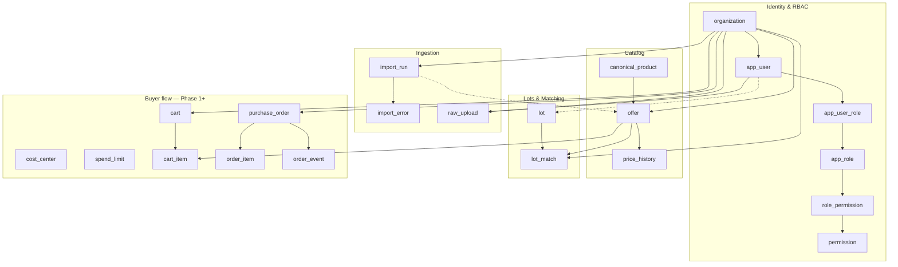

# ER-диаграмма базы данных

> **⚠️ Поддерживайте этот файл в актуальном состоянии**
>
> При изменении доменной модели (Flyway-миграции, JPA-сущности в `com.sauda.domain.entity`)
> **обязательно обновите Mermaid-блок ниже** в том же PR.
>
> Источник правды: `backend/sauda-api/src/main/resources/db/migration/`  
> Последняя миграция на момент обновления: **V3__lot_mvp_structure.sql**

## Как обновлять

1. Изменили схему в `db/migration/V*.sql` и/или entity → откройте этот файл.
2. Обновите блок `erDiagram` (таблицы, поля, связи). Соблюдайте [ограничения синтаксиса Mermaid](#полная-er-диаграмма) ниже.
3. Обновите строку «Последняя миграция» в шапке.
4. Проверьте рендер на [mermaid.live](https://mermaid.live).

Связанные документы: [auth-rbac.md](auth-rbac.md) (роли и permissions), [architecture.md](architecture.md), [lot-mvp-structure.md](lot-mvp-structure.md) (поля lot / lot_match для MVP).

---

## Обзор доменов

---

## Полная ER-диаграмма

```mermaid
erDiagram
    organization {
        uuid id PK
        organization_type type
        text name
        varchar bin
        boolean vat_payer
        timestamptz created_at
    }

    app_user {
        uuid id PK
        uuid organization_id FK
        citext email
        text password_hash
        boolean is_active
        timestamptz created_at
    }

    app_role {
        uuid id PK
        text code
        organization_type organization_type
        text name
        text description
        timestamptz created_at
    }

    permission {
        uuid id PK
        text code
        text resource
        text action
        text description
    }

    role_permission {
        uuid role_id FK
        uuid permission_id FK
    }

    app_user_role {
        uuid user_id FK
        uuid role_id FK
        timestamptz granted_at
    }

    canonical_product {
        uuid id PK
        text normalized_name
        text category
        text brand
        text model_mpn
        text mpn_norm
        jsonb attributes
        boolean is_active
        timestamptz created_at
        timestamptz updated_at
    }

    offer {
        uuid id PK
        uuid distributor_id FK
        uuid canonical_product_id FK
        text internal_sku
        text raw_name
        text brand
        text model_mpn
        numeric price
        char currency
        boolean price_includes_vat
        integer stock_quantity
        stock_status stock_status
        text lead_time
        timestamptz last_updated_at
        uuid source_file_id FK
        timestamptz created_at
    }

    price_history {
        uuid id PK
        uuid offer_id FK
        numeric price
        char currency
        stock_status stock_status
        timestamptz captured_at
    }

    lot {
        uuid id PK
        text source
        text external_purchase_id
        text external_lot_id
        text title
        text customer_name
        text category
        text description
        text procurement_method
        text lot_type
        integer quantity
        text unit
        numeric budget_amount
        char currency
        text delivery_location
        timestamptz delivery_deadline
        timestamptz submission_deadline
        text warranty_requirements
        text technical_requirements
        text required_documents
        text qualification_requirements
        text contract_terms_summary
        timestamptz published_at
        lot_status status
        text source_url
        text raw_text
        jsonb raw_data
        uuid created_by FK
        timestamptz created_at
        timestamptz updated_at
    }

    lot_match {
        uuid id PK
        uuid lot_id FK
        uuid offer_id FK
        uuid distributor_id FK
        lot_match_status match_status
        numeric confidence_score
        text match_reason
        jsonb matched_requirements
        jsonb missing_requirements
        jsonb risk_flags
        integer required_quantity
        integer available_quantity
        check_result quantity_check
        check_result stock_check
        check_result price_check
        numeric estimated_unit_price
        numeric estimated_total_price
        numeric budget_amount
        numeric estimated_margin
        boolean needs_manual_review
        text admin_comment
        text distributor_comment
        timestamptz created_at
        timestamptz updated_at
    }

    import_run {
        uuid id PK
        uuid distributor_id FK
        timestamptz started_at
        timestamptz finished_at
        integer rows_total
        integer rows_ok
        integer rows_err
        import_status status
        text source_filename
    }

    import_error {
        uuid id PK
        uuid import_run_id FK
        integer source_row
        text reason
        jsonb raw
    }

    raw_upload {
        uuid id PK
        uuid distributor_id FK
        uuid uploaded_by_user_id FK
        varchar uploaded_by_role
        text original_filename
        text storage_path
        bigint file_size
        varchar mime_type
        varchar checksum
        raw_upload_status status
        text error_message
        timestamptz created_at
        timestamptz updated_at
    }

    cost_center {
        uuid id PK
        uuid buyer_company_id FK
        text name
    }

    spend_limit {
        uuid id PK
        uuid buyer_company_id FK
        uuid user_id FK
        uuid role_id FK
        text period
        numeric amount
    }

    cart {
        uuid id PK
        uuid buyer_company_id FK
        uuid created_by FK
        cart_status status
        timestamptz created_at
    }

    cart_item {
        uuid id PK
        uuid cart_id FK
        uuid offer_id FK
        integer qty
        numeric price_snapshot
    }

    purchase_order {
        uuid id PK
        uuid buyer_company_id FK
        uuid created_by FK
        uuid cost_center_id FK
        order_status status
        numeric total
        numeric vat_total
        uuid approved_by FK
        timestamptz created_at
    }

    order_item {
        uuid id PK
        uuid order_id FK
        uuid offer_id FK
        uuid canonical_product_id FK
        integer qty
        numeric unit_price_snapshot
        numeric vat_rate
    }

    order_event {
        uuid id PK
        uuid order_id FK
        order_status from_status
        order_status to_status
        uuid actor FK
        text note
        timestamptz at
    }

    organization ||--o{ app_user : employs
    app_role ||--o{ role_permission : grants
    permission ||--o{ role_permission : includes
    app_user ||--o{ app_user_role : has
    app_role ||--o{ app_user_role : assigned
    organization ||--o{ offer : distributes
    canonical_product ||--o{ offer : matched_to
    offer ||--o{ price_history : tracks
    app_user ||--o{ lot : creates
    lot ||--o{ lot_match : matches
    offer ||--o{ lot_match : matched_in
    organization ||--o{ lot_match : distributor
    organization ||--o{ import_run : imports
    import_run ||--o{ import_error : errors
    import_run ||--o{ offer : source_file
    organization ||--o{ raw_upload : raw_files
    app_user ||--o{ raw_upload : uploaded_by
    organization ||--o{ cost_center : buyer
    organization ||--o{ spend_limit : buyer
    app_user ||--o{ spend_limit : user_limit
    app_role ||--o{ spend_limit : role_limit
    organization ||--o{ cart : buyer
    app_user ||--o{ cart : created_by
    cart ||--o{ cart_item : contains
    offer ||--o{ cart_item : referenced
    organization ||--o{ purchase_order : buyer
    app_user ||--o{ purchase_order : creates
    app_user ||--o{ purchase_order : approves
    cost_center ||--o{ purchase_order : charged_to
    purchase_order ||--o{ order_item : line_items
    offer ||--o{ order_item : referenced
    canonical_product ||--o{ order_item : snapshot
    purchase_order ||--o{ order_event : audit
    app_user ||--o{ order_event : actor
```

**PostgreSQL ENUM types** (не отдельные таблицы): `organization_type`, `stock_status`, `lot_status`, `lot_match_status`, `check_result`, `cart_status`, `order_status`, `import_status`. Базовые значения — в `V2__init.sql`; расширения `lot_status` и `lot_match_status` — в `V3__lot_mvp_structure.sql`; `low_stock` в `stock_status` — в `V5__phase0_money_vat_stock.sql`. НДС на offer: `price_includes_vat BOOLEAN` (не enum).

**Ограничения Mermaid:** в атрибутах только `PK` / `FK` / `UK`; без стрелок `→` и без inline-комментариев в кавычках внутри `erDiagram` (ломают парсер). Детали колонок — в миграции.

---

## Служебные таблицы (вне бизнес-ER)

| Таблица | Миграция | Назначение |
|---------|----------|------------|
| `schema_version_marker` | V1 | Baseline-маркер Flyway, не домен |

## JPA ↔ SQL

| SQL-таблица | JPA entity |
|-------------|------------|
| `organization` | `Organization` |
| `app_user` | `AppUser` |
| `app_role` | `Role` |
| `permission` | `Permission` |
| `canonical_product` | `CanonicalProduct` |
| `offer` | `Offer` |
| `price_history` | `PriceHistory` |
| `lot` | `Lot` |
| `lot_match` | `LotMatch` |
| `import_run` | `ImportRun` |
| `import_error` | `ImportError` |
| `raw_upload` | `RawUpload` |
| `cost_center` | `CostCenter` |
| `spend_limit` | `SpendLimit` |
| `cart` | `Cart` |
| `cart_item` | `CartItem` |
| `order` | `PurchaseOrder` |
| `order_item` | `OrderItem` |
| `order_event` | `OrderEvent` |
