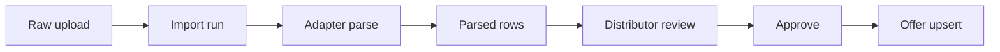

# Import framework (SAUDA-008)

Краткий гайд по каркасу импорта прайс-листов: от загрузки raw-файла до обновления `offer`.

## Поток данных

1. **Загрузка** — `POST /distributors/{id}/raw-uploads` (`import:run`).
2. **Авто-запуск** — после commit `RawUploadStoredEvent` → `ImportTriggerListener` создаёт `import_run` и вызывает `process()`.
3. **Парсинг** — адаптер (`csv_v1`, `xlsx_v1`) возвращает `AdapterParseResult`; строки сохраняются как `parsed_row`.
4. **Проверка** — дистрибьютор смотрит строки, правит (`import:approve`), подтверждает или отклоняет.
5. **Применение** — `OfferUpsertService` upsert по `(distributor_id, internal_sku)`; статус run → `applied`.

## State machine (`import_run.status`)

| Статус | Смысл |
|--------|--------|
| `pending` | Run создан, обработка ещё не началась |
| `processing` | Адаптер парсит файл |
| `parsed` / `parsed_with_errors` | Строки сохранены |
| `awaiting_approval` | Готов к ревью дистрибьютора |
| `approved` | Решение принято (кратковременно перед apply) |
| `applied` | Offer обновлены |
| `rejected` | Дистрибьютор отклонил |
| `failed` | Фatal error (файл или apply) |

Переходы — `ImportRunStatusTransitions` (unit-тест покрывает все allowed/disallowed).

## Как добавить новый адаптер (например 1С)

Ядро **не меняется**. Достаточно нового класса в `service/imports/adapter/`:

1. Реализовать `ImportAdapter`:
   - `key()` — уникальный идентификатор, напр. `onec_v1`
   - `supports(ImportSource source)` — по MIME/расширению
   - `parse(ImportSource source)` → `AdapterParseResult`
2. Зарегистрировать как Spring `@Component` — попадёт в `ImportAdapterRegistry`.
3. Маппинг колонок → `ImportRowFields` через `ImportRowMapper` (или свой mapper с теми же полями).
4. Добавить sample-фикстуру в `src/test/resources/imports/` и unit-тест адаптера.

Open/Closed: orchestration (`ImportRunService`), API, approve/apply остаются без изменений.

## Permissions

| Permission | Кто | Действие |
|------------|-----|----------|
| `import:run` | distributor_manager | Загрузка файла |
| `import:read` | manager, viewer, platform_admin | Просмотр runs/строк |
| `import:approve` | distributor_manager only | Edit / approve / reject |

Admin: глобальный `GET /import-runs` (только read). Approve/edit недоступны.

## Sample-файлы

- Тестовый CSV: `backend/sauda-api/src/test/resources/imports/sample_price.csv`
- Для ручной загрузки: [sample_price.csv](sample_price.csv)
- Demo run после миграции `V11`: логин `distributor-a@shop.kz` → раздел «Импорты»

## Связанные документы

- [architecture.md](architecture.md) — слои и event-driven trigger
- [auth-rbac.md](auth-rbac.md) — матрица permissions
- [er-diagram.md](er-diagram.md) — `import_run`, `parsed_row`, связи
